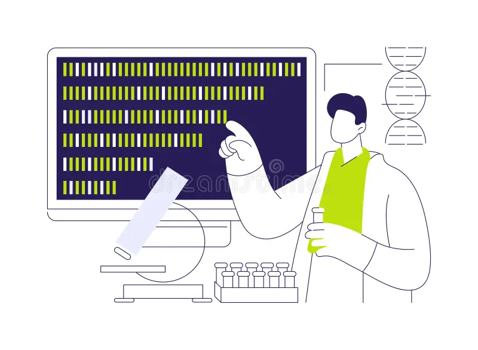

Below are a series of diagrams that illustrate some of the ways we measure DNA and other factors in your blood. You can find out more in French at {target="_blank" rel="noopener noreferrer"}.

The diagram below shows an example of a "SNP" (Single nucleotide polymorphism) a single change in DNA. It is these changes we are interesed in. We measure millions of them, including 10,000s in your DNA

{fig-align="center" width="50%"}.

We can measure these SNPs and other types of variations in your DNA in several different ways. In the future we hope to be able to sequence, that is, read the entire genetic code with the help of a technique called "Whole Genome sequencing"

{fig-align="center" width="50%"}.

We may also measure other factors in your blood sample, a part of the blood called plasma

{fig-align="center" width="50%"}.

The images above come from the [web site](https://victr.vumc.org/what-is-biovu/){target="_blank" rel="noopener noreferrer"}.
