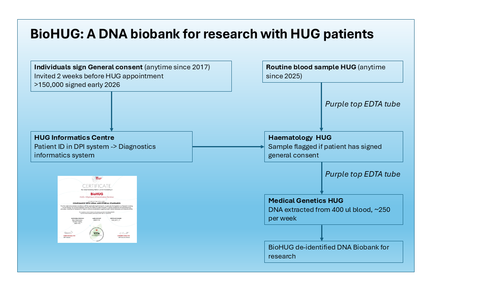

BioHUG a été créé en 2024 et a commencé à constituer une banque d'échantillons d'ADN provenant de patients ayant signé le consentement général en février 2025. Ce projet a été approuvé par la direction de l'HUG et soutenu par la Faculté de médecine. L'équipe informatique de l'HUG a mis en place un système qui génère quotidiennement des listes d'échantillons sanguins provenant de patients ayant signé le consentement général. Ces listes sont traitées deux à trois fois par semaine afin d'éviter tout doublon. Notre technicien de laboratoire, M. Tiago De Sousa, du service de génétique médicale, récupère la liste et va chercher les échantillons de sang disponibles au service d'hématologie par lots de 48. Tiago vérifie ensuite que les échantillons ne sont pas coagulés et qu'ils contiennent au moins 1,5 ml de sang avant d'extraire l'ADN au laboratoire de génétique médicale de l'HUG. La plupart des semaines, il traite entre 200 et 250 échantillons sanguins. À l'été 2025, une autorisation éthique a été obtenue pour établir un lien avec des études de recherche et donner la priorité aux échantillons provenant de ces études. Si vous menez déjà une étude de recherche ou gérez un registre de patients, ou si vous souhaitez mettre en place une étude de recherche, et que vous êtes intéressé par la conservation d'ADN de manière rentable, veuillez nous contacter à l'adresse Timothy.frayling\@unige.ch. Si vous souhaitez prélever du sérum et du plasma, cela est également possible. Pour plus de détails, consultez le [Comment utiliser](howtouse.qmd) page.

{fig-align="center" width="75%"}
