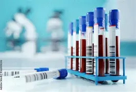

BioHUG est une collection, ou « banque », d’échantillons humains "sans identification", provenant de l’Hôpital universitaire de Genève. BioHUG a pour but d’aider les chercheurs dans leurs études sur les maladies et la médecine personnalisée, en partenariat avec les patients des HUG. Pour ce faire, l’un desprincipaux objectifs de BioHUG est de faciliter la collecte et l’utilisation sécurisée d’échantillons dé-identifiés (pas de noms, d'adresses ni de dates de naissance) provenant de patients, notamment les échantillons sanguins qui ne sont plus nécessaires en clinique et qui, au lieu d’être jetés, peuvent servir à la recherche. Ces échantillons sont conservés en toute sécurité afin que les chercheurs puissent s’en servir pour évaluer des facteurs importants liés à des maladies, tels que des variations génétiques susceptibles d’influencer le développement de maladie ou la réponse à certains traitements. {fig-align="center" width="75%"}

Ce site internet fournit des informations à ces patients et chercheurs des HUG. Pour plus d’informations, n’hésitez pas à envoyer un email au chef du project timothy.frayling\@unige.ch.

Nous tenons à remercier les HUG, les [patients partenaires](https://www.hug.ch/patients-partenaires){target="_blank" rel="noopener noreferrer"} (programme 3P+), la Fondation privée des HUG, mais surtout les patients des HUG qui ont accepté, via le brochure de consentement, que leurs données de routine et leurs échantillons puissent être réutilisés par des chercheurs, dans des conditions appropriées et sécurisées.

::::: {.columns .text-center}
::: column
<a href="fr/researchers/index.qmd" class="big-link-box">Pour les chercheurs </a>
:::

::: column
<a href="fr/patients/index.qmd" class="big-link-box">Pour les patients</a>
:::
:::::


