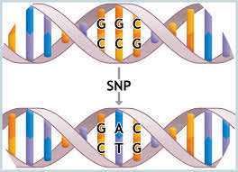
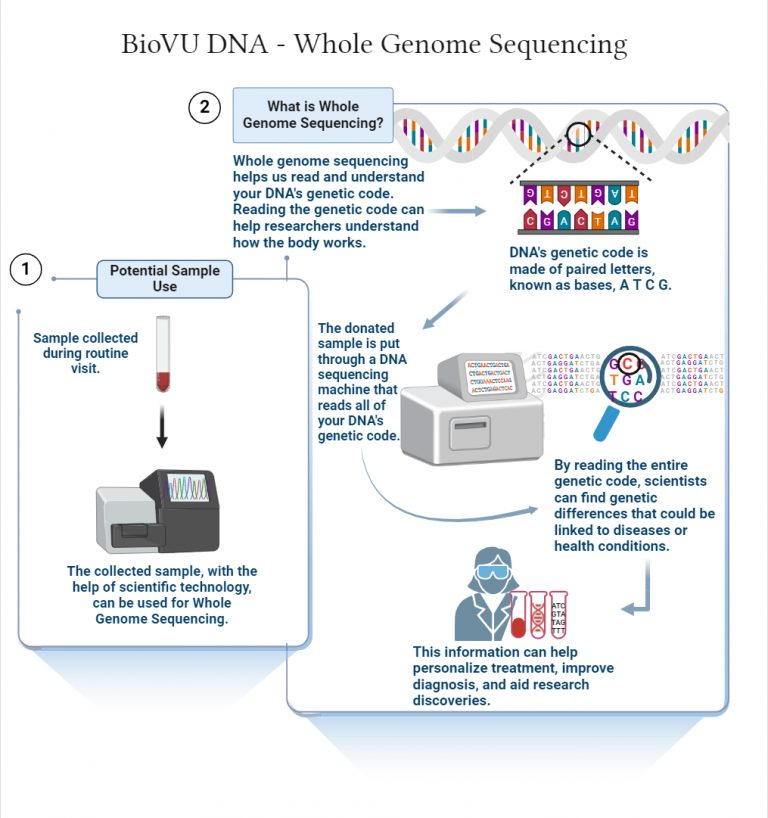
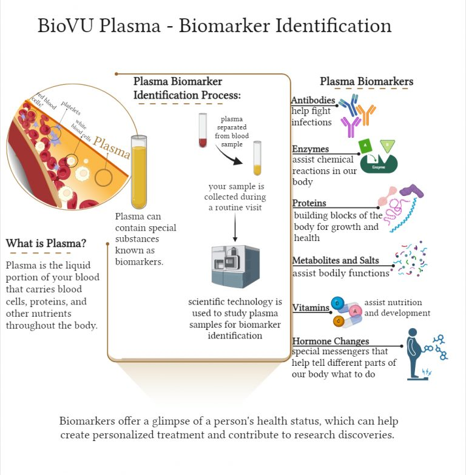

Below are a series of diagrams that illustrate some of the ways we measure DNA and other factors in your blood.

{fig-align="center" width="50%"}

{fig-align="center" width="50%"}

{fig-align="center" width="50%"}
