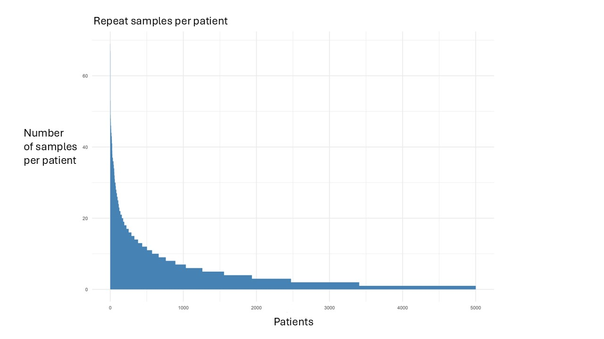

::: {.callout collapse="true"}
### Can you prioritise samples from patients in my research study or registry ?

Yes. If the HUG patients in your research study or registry have signed the general consent, and not subsequently withdrawn that consent, we can prioritise their samples for DNA extraction. Note that the DNA banking step relies on a patient having a separate blood test as part of their routine care in the Canton de Geneve.
:::

::: {.callout collapse="true"}
### Will I need additional ethical approval to use BioHUG ?

Yes. You will need to apply for ethical approval for your specific research study but BioHUG can do several things to help: 
1. If you wish to make a collection of DNA, we can help collect these samples from HUG patients who have signed the general consent (150,000 in early 2026) in a very cost efficient way. 
2. If you have a group of HUG patients in your study or registry and you wish to reuse genetic data from those who are already in BioHUG. 
3. Help design your study. For example if you wish to start with HUG patients who already have a banked DNA sample or genetic data.
:::

::: {.callout collapse="true"}
### Can I collect more than one sample from the same patient ?

Yes if you let us know we can prioritise collection of 2 or more samples from the same patient. We do this securely in the HUG system, but you need to inform us because the default is to only collect one DNA sample per patient. {fig-align="center" width="75%"}. 

:::

::: {.callout collapse="true"}
### Are samples other than DNA available ?

As of March 2026, no. Since beginning DNA biobanking in February 2025, BioHUG has collected only DNA samples. However, it may be possible later in 2026 or 2027 to bank serum and plasma samples and we will be able to do this in a very cost efficient way, at least from HUG patients who have signed the general consent. There may be a small charge for this, depending on the outcome of additional funding applications.
:::

::: {.callout collapse="true"}
### How much does it cost ?

Nothing for DNA banking. There is no cost to researchers to bank DNA. Funding is in place to extract DNA from 20,000 HUG patients who have signed the general consent. This initial collection will be complete in early 2027. We will also have genome wide genetic data, from the GSAMD Illumina array available from 5000 in summer 2026. In the interests of data security the individual level data will only be available to trained researchers. We will be able to provide summary level data at no cost.

Genetic data on additional samples, and banking of serum and plasma is subject to further funding, but we will be able to do this in a very cost efficient way. For more information please contact the PI of the study Prof. Timothy Frayling at timothy.frayling\@unige.ch
:::

::: {.callout collapse="true"}
### Is BioHUG accredited with the Swiss Biobanking platform ?

Yes. BioHUG has Swiss Biobanking Platform accreditation. More details [here](https://swissbiobanking.ch/sbp-directory/){target="_blank" rel="noopener noreferrer"}.
:::

::: {.callout collapse="true"}
### What are the inclusion and exclusion criteria for BioHUG ?

BioHUG consists of adult HUG patients who have signed the general consent as an adult at any point since 2017, not subsequently withdrawn that consent, and have had a routine blood test since February 2025. Samples from children may be collected if they are part of particular research studies with separate study-specific consent.
:::

::: {.callout collapse="true"}
### How representative is BioHUG ?

BioHUG is very representative of the background Geneva population. No new blood sample or research questions or tests are performed. This lowers the barriers to participation. We estimate that 25% of participants are of non-European genetic ancestry.
:::

::: {.callout collapse="true"}
### Can I bank DNA from patients outside of HUG, e.g. other parts of Switzerland ?

This may be possible with some additional financial support, but the priority is HUG patients.
:::
